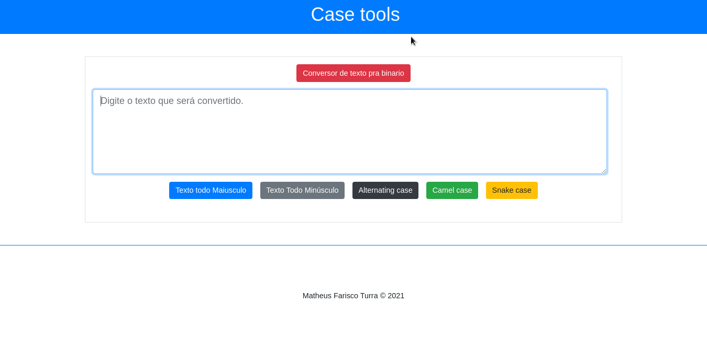

<h1 align="center">
   Case Tools
</h1>
<hr>

O projeto **Case Tools** é um simples conversor de diferentes tipos de texto, incluindo conversão de texto para binário, CamelCase e outros.

## :computer: Demonstração


<h1>

  
</h1>

## 	:bulb: Tecnologias utilizadas


O projeto foi criado utilizando as seguintes tecnologias:

- [Angular JS](https://angular.io/)
- [Node JS](https://nodejs.org/en/)
- [Express](https://expressjs.com/pt-br/)

## :briefcase: Como baixar o projeto:


```bash

  # clona o repositório
  $ git clone https://github.com/MatheusTurra/CaseTools

  # entrar no diretório
  $ cd CaseTools

  # instalar as dependências
  $ npm install

  # inicializa a aplicação
  $ npm run start
```
---
<p align="center">
Desenvolvido por Matheus Farisco Turra 	:hurtrealbad:
<p>
